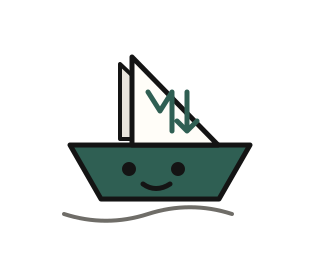

<p align="center">
  
</p>

<h1 align="center">Ragship</h1>

<p align="center">
  Run a local RAG app over a folder of Markdown files.
</p>

<p align="center">
  <code>ragship ./docs</code>
</p>

---

Ragship indexes Markdown files, stores embeddings locally, and serves a small chat UI with source citations. It uses Ollama for embeddings and generation, and libSQL for vector search.

It is meant for personal knowledge bases, internal docs, exported wikis, and project notes.

## Features

- Local-first: files, database, and model calls stay on your machine.
- Folder-based: point it at any Markdown directory.
- Incremental ingest: unchanged files are skipped.
- Source citations: answers include the chunks used.
- Small surface area: TypeScript, Fastify, Ollama, libSQL.
- Built-in UI: landing page plus a minimal chat app.

## Requirements

- Node.js 20+
- Ollama, or Docker Compose for the bundled Ollama service
- Markdown files

On macOS, native Ollama is recommended because Docker does not expose the Apple GPU to Linux containers.

## Install

```bash
npm install -g ragship
```

Or run without installing:

```bash
npx ragship ./docs
```

## Usage

```bash
ragship ./docs
```

The first run:

1. checks Ollama;
2. pulls the configured models if missing;
3. creates the database schema;
4. indexes Markdown files;
5. starts the web server.

Open:

```text
http://localhost:3000
```

The chat app is available at:

```text
http://localhost:3000/app
```

## CLI

```text
ragship <docs-folder> [options]

Options:
  -d, --docs-dir <path>      Folder with Markdown files
  -p, --port <number>        HTTP server port
  --db-url <url>             libSQL database URL
  --ollama-url <url>         Ollama base URL
  --embedding-model <model>  Ollama embedding model
  --llm-model <model>        Ollama generation model
  -h, --help                 Show help
```

Examples:

```bash
ragship ./notes --port 8080
ragship --docs-dir ./handbook --llm-model llama3.1:8b
```

## Configuration

CLI options can also be set with environment variables.

| Variable | Default | Description |
|---|---:|---|
| `DOCS_DIR` | `./docs` | Markdown folder |
| `PORT` | `3000` | HTTP server port |
| `DATABASE_URL` | `file:./data/rag.db` | libSQL database URL |
| `DATABASE_AUTH_TOKEN` | empty | Token for remote libSQL/Turso |
| `OLLAMA_BASE_URL` | `http://localhost:11434` | Ollama endpoint |
| `OLLAMA_EMBEDDING_MODEL` | `nomic-embed-text` | Embedding model |
| `OLLAMA_LLM_MODEL` | `llama3.2:1b` | Generation model |
| `RAG_TOP_K` | `4` | Chunks sent to the model |
| `OLLAMA_NUM_CTX` | `2048` | Generation context window |
| `CHUNK_MIN_CHARS` | `1000` | Minimum chunk size |
| `CHUNK_MAX_CHARS` | `2400` | Maximum chunk size |
| `CHUNK_OVERLAP_CHARS` | `350` | Chunk overlap |

## Ollama

### Native

```bash
brew install ollama
ollama serve
ragship ./docs
```

### Docker Compose

```bash
docker compose up -d
ragship ./docs
```

The CLI will try to start Docker Compose automatically when Ollama is not reachable.

## API

### Health

```bash
curl http://localhost:3000/health
```

### Ask

```bash
curl -X POST http://localhost:3000/ask \
  -H "Content-Type: application/json" \
  -d '{"question":"How do I deploy this?"}'
```

Response:

```json
{
  "answer": "...",
  "sources": [
    {
      "title": "Deploy",
      "section": "Production",
      "relativePath": "deploy.md",
      "score": 0.91
    }
  ]
}
```

## How it works

```text
Markdown folder
   ↓
loader + chunker
   ↓
Ollama embeddings
   ↓
libSQL vector index
   ↓
question embedding
   ↓
vector search
   ↓
prompt with cited chunks
   ↓
Ollama answer
```

## Project layout

```text
src/
  cli.ts              command entry point
  server.ts           Fastify server
  ask.ts              RAG answer pipeline
  ingest.ts           indexing pipeline
  chunker.ts          Markdown chunking
  markdown-loader.ts  Markdown reader
  db.ts               libSQL access
  schema.ts           database schema
  ollama.ts           Ollama client helpers
  config.ts           CLI/env configuration
  ui.html             chat app
  landing.html        static landing page
assets/
  ragship-mascot.svg
```

## Development

```bash
npm install
npm run typecheck
npm run dev -- ./sample-docs
```

Build the CLI/server app that exposes the chat UI:

```bash
npm run build:app
```

Build the Vercel landing page only:

```bash
npm run build:landing
```

Build both:

```bash
npm run build
```

## License

MIT
